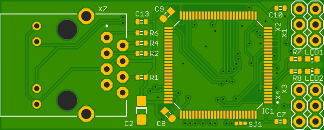
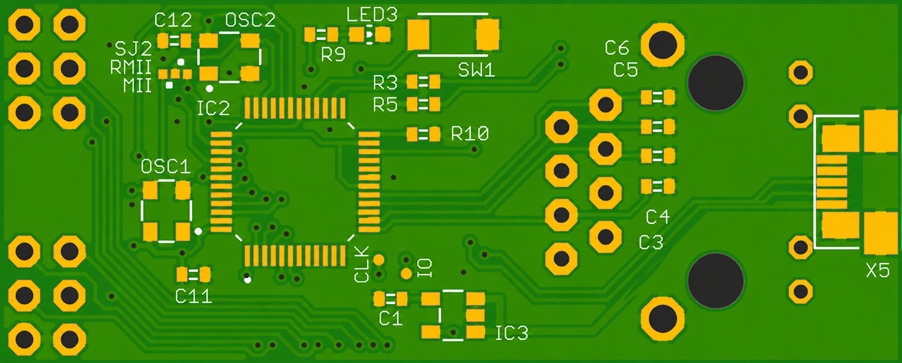

# ETH-UART PCB

An STM32-based Ethernet-to-UART development board designed in Autodesk EAGLE.

The board combines an STM32F407VE microcontroller with a DP83848 Ethernet PHY, RJ45 Ethernet interface, USB connectivity, multiple UART interfaces, SWD programming/debug access, status LEDs, test points, and selectable configuration jumpers.

## Features

- **MCU:** STM32F407VE
- **Ethernet PHY:** TI DP83848
- **Ethernet connector:** RJ45 with integrated magnetics
- **USB:** Micro-B connector
- **UART:** UART1, UART2, UART3 and UART5 signals are brought out in the design
- **Debug/programming:** SWDIO and SWCLK
- **Clocks:** 8 MHz MCU oscillator and 25 MHz Ethernet PHY oscillator
- **Power:** 5 V input with 3.3 V regulation
- **Indicators:** Ethernet/activity/status LEDs
- **Test access:** IO and CLK test points
- **PCB size:** approximately **52 mm × 21 mm**
- **Design tool:** Autodesk EAGLE 9.6.2

## Repository Contents

```text
.
├── eth-uart.sch              # EAGLE schematic
├── eth-uart.brd              # EAGLE PCB layout
├── eagle.epf                 # EAGLE project file
├── LICENSE                   # BSD 2-Clause license
└── doc/
    ├── img/
    │   ├── pcb_top.png
    │   └── pcb_bottom.png
    └── gerber/
        ├── copper_top.gbr
        ├── copper_bottom.gbr
        ├── soldermask_top.gbr
        ├── soldermask_bottom.gbr
        ├── silkscreen_top.gbr
        ├── silkscreen_bottom.gbr
        ├── profile.gbr
        ├── drills.xln
        └── project.gvp
```

## PCB Preview

### Top



### Bottom



## Main Interfaces

The schematic exposes the following signal groups:

| Interface | Signals |
|---|---|
| Ethernet | TXDP, TXDM, RXDP, RXDM |
| Ethernet MAC | ETH_TXD0–ETH_TXD3, ETH_RXD0–ETH_RXD3, ETH_TX_EN, ETH_RX_DV, ETH_RX_CLK, ETH_TX_CLK, ETH_CRS, ETH_COL, ETH_MDC, ETH_MDIO |
| UART | UART1_TX/RX, UART2_TX/RX, UART3_TX/RX, UART5_TX/RX |
| USB FS | USB_FS_DP, USB_FS_DM |
| Debug | SWD_IO, SWD_CLK |
| Boot | BOOT0 |
| Clock | SYS_CLK, PHY_OSC |

## Opening the Design

Open the project with **Autodesk EAGLE 9.x** or a compatible version.

1. Open `eagle.epf`.
2. Open `eth-uart.sch` to inspect the schematic.
3. Open `eth-uart.brd` to inspect or modify the PCB layout.
4. Review the design-rule settings and libraries before manufacturing or making major changes.

> **Note:** This repository contains EAGLE design files and generated Gerbers. Verify the design, component availability, footprints, and manufacturing rules before ordering a PCB.

## Manufacturing

The `doc/gerber/` directory contains the generated manufacturing files.

Before sending the files to a PCB manufacturer, verify:

- board outline/profile
- copper layers
- solder-mask layers
- silkscreen layers
- drill file
- required stack-up and fabrication tolerances
- component footprints and assembly requirements

## License

This project is released under the **BSD 2-Clause License**. See [`LICENSE`](LICENSE) for the full license text.

## Credits

Copyright © 2018 Vasilii Chumakov.

